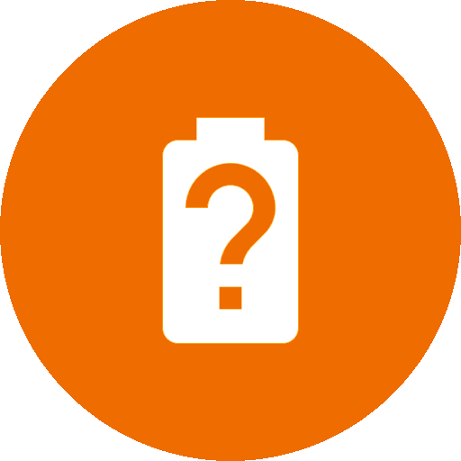
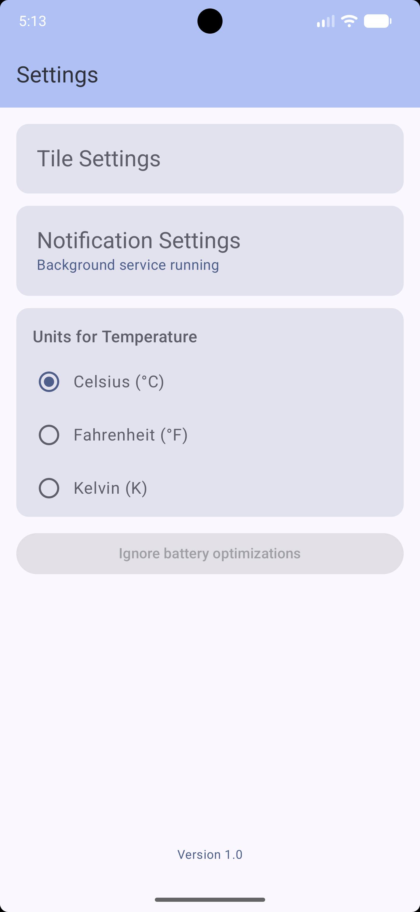
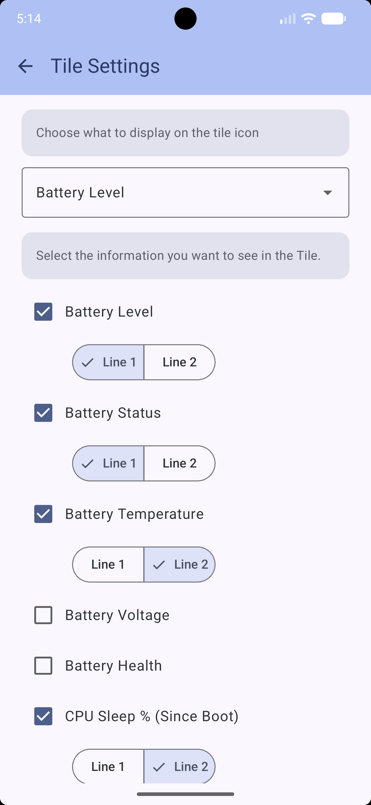
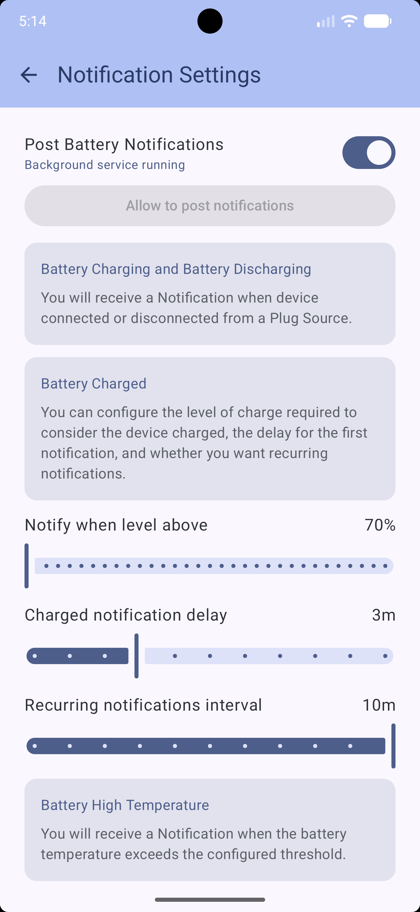
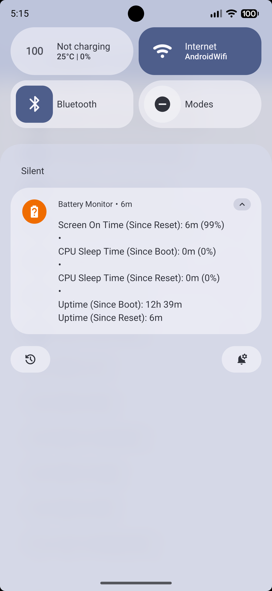

<div align="center">
  

  # Battery Monitor

  **A full-featured battery information app for Android**

  <p>
    
    
    
    
    
    
  </p>

  <p>
    <a href="#features">Features</a> •
    <a href="#screenshots">Screenshots</a> •
    <a href="#build">Build</a> •
    <a href="#certificate">Certificate</a> •
    <a href="#license">License</a>
  </p>
</div>

---

## Features

<table>
  <tr>
    <td width="50%">
      <h4>QS Tile</h4>
      <ul>
        <li>Battery percentage, temperature, deep sleep % or status on the icon</li>
        <li>Two configurable lines of info (status, temperature, voltage, …)</li>
        <li>Configurable tap action: opens system battery page or this app</li>
        <li>Dynamic icon (charging / discharging / full drawables)</li>
      </ul>
    </td>
    <td width="50%">
      <h4>Persistent Notification</h4>
      <ul>
        <li>Level, status, temperature, voltage, health, plug type, technology</li>
        <li>Screen-on time, deep sleep stats, uptime, charging time, capacity</li>
        <li>Re-orderable fields</li>
        <li>Per-field visibility toggle</li>
      </ul>
    </td>
  </tr>
  <tr>
    <td width="50%">
      <h4>Alerts</h4>
      <ul>
        <li>🔌 Power connected / disconnected notification</li>
        <li>🔋 Battery charged (configurable threshold, delay, <b>repeat interval</b>)</li>
        <li>🌡️ High temperature alert (configurable threshold)</li>
        <li>🚫 Optional: block disconnect notification when battery is charged</li>
      </ul>
    </td>
    <td width="50%">
      <h4>Smart Auto-Reset</h4>
      <ul>
        <li>Auto-resets screen-on and deep sleep counters on disconnect</li>
        <li>Configurable <b>minimum charge percentage and time</b> for reset</li>
        <li>Manual reset with confirmation dialog</li>
        <li>Shows last reset reason, timestamp, battery level, and deep sleep %</li>
      </ul>
    </td>
  </tr>
  <tr>
    <td width="50%">
      <h4>Battery Information</h4>
      <ul>
        <li>Real-time level, temperature, voltage, health, status, plug type</li>
        <li>Charge cycle count, technology, capacity status</li>
        <li>Screen-on and deep sleep stats (since boot / since reset)</li>
        <li>Charging time, uptime</li>
      </ul>
    </td>
    <td width="50%">
      <h4>Debug Logging</h4>
      <ul>
        <li>File-based logging for troubleshooting</li>
        <li>Option to log only while charging</li>
        <li>Share log files directly from the app</li>
        <li>View live log line count</li>
      </ul>
    </td>
  </tr>
  <tr>
    <td width="50%">
      <h4>Customization</h4>
      <ul>
        <li>Per-field visibility and line assignment (tile)</li>
        <li>Notification field order and separators</li>
        <li>Temperature unit: °C / °F / K</li>
        <li>Choose what the tile icon displays</li>
        <li>Configurable tap target (app / system battery page)</li>
      </ul>
    </td>
    <td width="50%">
      <h4>Material You</h4>
      <ul>
        <li>Dynamic colors on Android 12+</li>
        <li>Light / dark theme</li>
        <li>Compose Material3 UI</li>
      </ul>
    </td>
  </tr>
</table>

## Screenshots

<p align="center">
  
  
  
  
</p>
<p align="center">
  
  
  
  
</p>

## Build

```shell
./gradlew assembleDebug
```

The APK will be at `app/build/outputs/apk/debug/app-debug.apk`.

## Certificate

The SHA-256 digest of the signing certificate is consistent across all releases:

```
fb9ffdf13eabbed74f6ee27a21ef39af33d3400d3d6ccff505bba4d9b4542f3b
```

Verify with:

```shell
apksigner verify --verbose --print-certs app-release.apk | grep "Signer #1 certificate SHA-256 digest"
```

## License

This project is licensed under the **CC BY-NC-SA 4.0** License — see the [LICENSE](LICENSE.md) file for details.

<div align="center">
  <a href="https://creativecommons.org/licenses/by-nc-sa/4.0/">
    
  </a>
</div>
